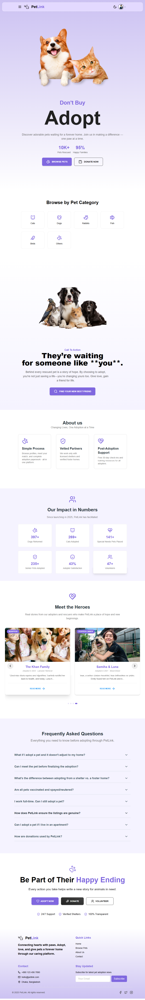

# PetLink - Pet Adoption Platform (Client)

# 🚀 Live Link

**Frontend Live URL:** [https://pet-link-client.vercel.app/](https://pet-link-client.vercel.app/)

---

# 🌈 Overview

PetLink is a full-featured pet adoption platform where users can explore and adopt pets, start donation campaigns, manage pets, and perform other pet and donation-related activities. It aims to bridge the gap between pet givers and pet seekers through an easy-to-use, visually engaging platform.

This repository contains the **frontend/client-side** code for the PetLink platform.

---

# 📝 Key Features

* Beautiful, responsive design using **TailwindCSS** and **Material Tailwind**
* Authentication with **Firebase** (Email/Password + Social logins)
* **JWT Authentication**
* Role-based dashboard: **Admin** and **User**
* **Infinite scroll** for Pet and Donation listings
* **Protected routes with JWT authentication**
* Donation with **Stripe** Payment Integration
* Adoption request and donation refund system
* Modern editor support **(TipTap)**
* **TanStack React Query** for efficient data fetching
* **Recharts** for data visualization
* **Fully responsive on all screen sizes**
* **Dark & Light theme toggle**

---

# 🏆 Tech Stack

### Core Technologies

* **React 19**
* **Vite**
* **Tailwind CSS**
* **Material Tailwind**
* **Firebase Authentication**
* **React Router v7**

### Libraries & Utilities

* **React Hook Form**
* **TanStack Query**
* **React Select**
* **React Day Picker**
* **Lucide React**
* **Swiper**
* **TipTap & Slate (WYSIWYG Editors)**
* **Axios**
* **Stripe** (Payment Integration)
* **React Hot Toast**
* **Recharts**

---

# 🔗 Main Pages

### 🏠 Home Page

* Logo, navigation, and profile dropdown
* Banner, pet categories, call-to-action, about us
* Custom sections related to adoption and donation

### 🐾 Pet Listing & Details

* Infinite scroll for pet cards
* Filter by name and category
* Adoption modal with user & pet info autofilled

### 💼 Dashboard (User & Admin)

* Sidebar + top navbar layout
* Role-based views and permissions
* Add/Update Pets with image upload
* Donation Campaign creation
* My Donations, My Pets, Adoption Requests

### 💸 Donation System

* Donation campaigns listing with infinite scroll
* Payment with Stripe modal
* Campaign editing, pausing, and donator lists

### 👤 Authentication

* Email/password + social login (e.g., Google)
* JWT tokens stored securely
* Firebase profile updates & role management

### 📆 Admin Functionalities

* View & manage all users, pets, and donations
* Make users admin
* Force update/delete records

---

# 👨‍💼 Developer Guidelines

* Firebase keys are securely stored in environment variables
* Responsive design for mobile/tablet/desktop
* All GET requests use **TanStack Query**
* Reusable UI with component-based structure
* Commit messages are meaningful and descriptive

---

# 🌐 Deployment

* Client hosted on Vercel
* Ensure routes do not throw 404/CORS on reload
* Firebase auth domains configured for Vercel
* Private routes persist after reload (JWT validated)

---


---

# 📦 Packages Used

```bash
@material-tailwind/react, @stripe/react-stripe-js, @stripe/stripe-js, @tanstack/react-query, @tanstack/react-table,
@tiptap/*, axios, date-fns, firebase, ldrs, lucide-react, react, react-countup,
react-day-picker, react-dom, react-hook-form, react-hot-toast, react-intersection-observer,
react-router, react-select, recharts, slate, swiper, tiptap
```

DevDependencies include: eslint, tailwindcss, vite, postcss, autoprefixer, etc.

---


---

> ⚡ Built with love to connect pets to their forever families.


# Tech Stack 🛠️

### Frontend


### Backend Integration


### UI Libraries


### Text Editors


# PetLink - Local Development Setup Guide
Follow these steps to run the PetLink project on your local machine.

## Prerequisites
- Node.js (v16 or higher recommended)
- npm or yarn
- Git


## Step-by-Step Installation
1. **Clone the repository**
   ```bash
   git clone https://github.com/your-username/petlink.git
   cd petlink
   ```

2. **Set up environment variables**
    Create a .env file in the root directory and add the following variables with your own credentials:

    ```bash
        VITE_apiKey=YOUR_FIREBASE_API_KEY
        VITE_authDomain=YOUR_FIREBASE_AUTH_DOMAIN
        VITE_projectId=YOUR_FIREBASE_PROJECT_ID
        VITE_storageBucket=YOUR_FIREBASE_STORAGE_BUCKET
        VITE_messagingSenderId=YOUR_FIREBASE_MESSAGING_SENDER_ID
        VITE_appId=YOUR_FIREBASE_APP_ID
        VITE_imgbb_apiKey=YOUR_IMGBB_API_KEY
        VITE_payment_key=YOUR_STRIPE_PUBLIC_KEY
    ```

    You'll need to:
    - Create a Firebase project at https://firebase.google.com/
    - Get an ImgBB API key at https://imgbb.com/
    - Set up Stripe at https://stripe.com/


3. **Install dependencies**
   ```bash
        npm install
        # or
        yarn install
   ```
    
4. **Run The Development Server**
   ```bash
        npm run dev
        # or
        yarn dev
   ```

5. **Access the application**
    Open your browser and visit: http://localhost:5173


# ScreenShot 
<p align="center">
    
</p>